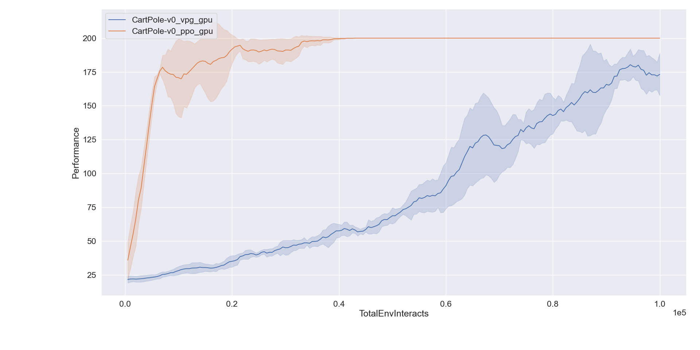

# **BasicRL**: easy and fundamental codes for deep reinforcement learning

****BasicRL**** is an improvement on [rainbow-is-all-you-need](https://github.com/Curt-Park/rainbow-is-all-you-need) and [OpenAI Spinning Up](https://spinningup.openai.com/en/latest/).  

It is developped for **beginner** in DRL with the following advantages:

* **Practical:** it fills the gap between the theory and practice of DRL.
* **Easy:** the codes is easier than [OpenAI Spinning Up](https://spinningup.openai.com/en/latest/) in terms of achieving the same functionality. 
* **Lightweight:** the core codes <1,500 lines, using Pytorch ans OpenAI Gym.

The following DRL algorithms is contained in ****BasicRL****:

* **DQN, DoubleDQN, DuelingDQN, NoisyDQN, DistributionalDQN**
* **REINFORCE, VPG, PPO, DDPG, TD3 and SAC**
* **PerDQN, N-step-learning DQN and Rainbow** are coming

The differences compared to [OpenAI Spinning Up](https://spinningup.openai.com/en/latest/):
* **Pros:** ****BasicRL**** is currently can be used on Windows and Linux (it hasn't been extensively tested on OSX). However, Spinning Up is only supported on Linux and OSX.
* **Cons:** OpenMPI is not used in **BasicRL** so it is slower than Spinning Up.
* **Others:** **BasicRL** considers an agent as a class.

The differences compared to [rainbow-is-all-you-need](https://github.com/Curt-Park/rainbow-is-all-you-need):
* **Pros:** **BasicRL** reuse the common codes, so it is lightwight. Besides, **BasicRL** modifies the form of output and plot, it can use the Spinning Up's log file.
* **Others:** **BasicRL** uses inheritance of classes, so you can see key differences between each other.

## File Structure
**BasicRL**:  
```
├─pg    
│  └─reinforce/vpg/ppo/ddpg/td3/sac.py    
│  └─utils.py      
│  └─logx.py     
├─pg_cpu     
│  └─reinforce/vpg/ppo/ddpg/td3/sac.py  
│  └─utils.py  
│  └─logx.py  
├─rainbow     
│  └─dqn/double_dqn/dueling_dqn/moisy_dqn/distributional_dqn.py  
│  └─utils.py   
│  └─logx.py   
├─requirements.txt  
└─plot.py
```

## Code Structure
### Core code
`xxx.py`(`dqn.py`...)
```
- agent class:
  - init
  - compute loss
  - update
  - get action
  - test agent
  - train
- main
```
### Common code
`utils.py`
```
- expereience replay buffer: On-policy/Off-policy replay buffer
- network  
```

`logx.py`
```
- Logger
- EpochLogger
```
`plot.py`
```
- plot data
- get datasets
- get all datasets
- make plots
- main
```

## Installation
**BasicRL** is tested on Anaconda virtual environment with Python3.7+
```
conda create -n BasicRL python=3.7
conda activate BasicRL
```
Clone the repository:
```
git clone git@github.com:RayYoh/BasicRL.git
cd BasicRL
```
Install required libraries:
```
pip install -r requirements.txt
```
**BasicRL** code library makes local experiments easy to do, and there are two ways to run them: either from the command line, or through function calls in scripts.

## Experiment
After testing, Basic RL runs perfectly, but its performance has not been tested. Users can tweak the parameters and change the experimental environment to output final results for comparison. One possible output is shown below:  


## Contribution
**BasicRL** is not yet complete and I will continue to maintain it. To any interested in making **BasicRL** better, any contribution is warmly welcomed. If you want to contribute, please send a Pull Request.  
If you are not familiar with creating a Pull Request, here are some guides:
* http://stackoverflow.com/questions/14680711/how-to-do-a-github-pull-request
* https://help.github.com/articles/creating-a-pull-request/

## Related Link
* [2017-Rainbow: Combining Improvements in Deep Reinforcement Learning](https://arxiv.org/pdf/1710.02298.pdf)
* [Policy Gradient Reinforcement Learning](https://rayyoh.github.io/posts/2021/09/blog-post-6/)
* [OpenAI Spinning Up](https://spinningup.openai.com/en/latest/)

## Citation
To cite this repository:
```
@misc{lei,
  author = {Lei Yao},
  title = {BasicRL: easy and fundamental codes for deep reinforcement learning},
  year = {2021},
  publisher = {GitHub},
  journal = {GitHub repository},
  howpublished = {\url{https://github.com/RayYoh/BasicRL}},
}
```